# biggan-deep-256 图片素材

由神经网络 biggan-deep-128 生成的图片

* 模型来源：[https://tfhub.dev/deepmind/biggan-deep-128/1](https://tfhub.dev/deepmind/biggan-deep-128/1)
* 使用 tensorflow 2.3 运行
* 共 1000 类，每类生成 100 张图片，以 jpg 格式储存

网页版：[https://playmat365.github.io/biggan_deep_128/](https://playmat365.github.io/biggan_deep_128/)

# 预览

点击图片可查看该分类

    [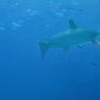](4_鱼_hammerhead)  [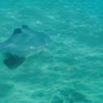](6_鱼_stingray) [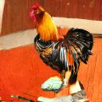](7_鸡_cock) [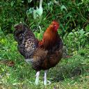](8_鸡_hen) [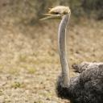](9_鸵鸟_ostrich)    [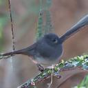](13_鸟_junco) [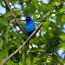](14_鸟_indigo_bunting) [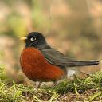](15_鸟_robin)   [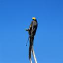](18_鸟_magpie)  [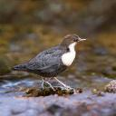](20_鸟_water_ouzel) [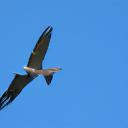](21_鸟_kite) [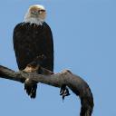](22_鹰_bald_eagle)  [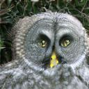](24_猫头鹰_great_grey_owl) [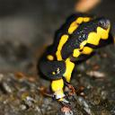](25_壁虎_European_fire_salamander)

